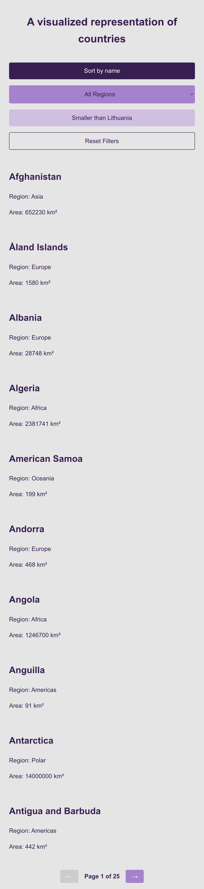
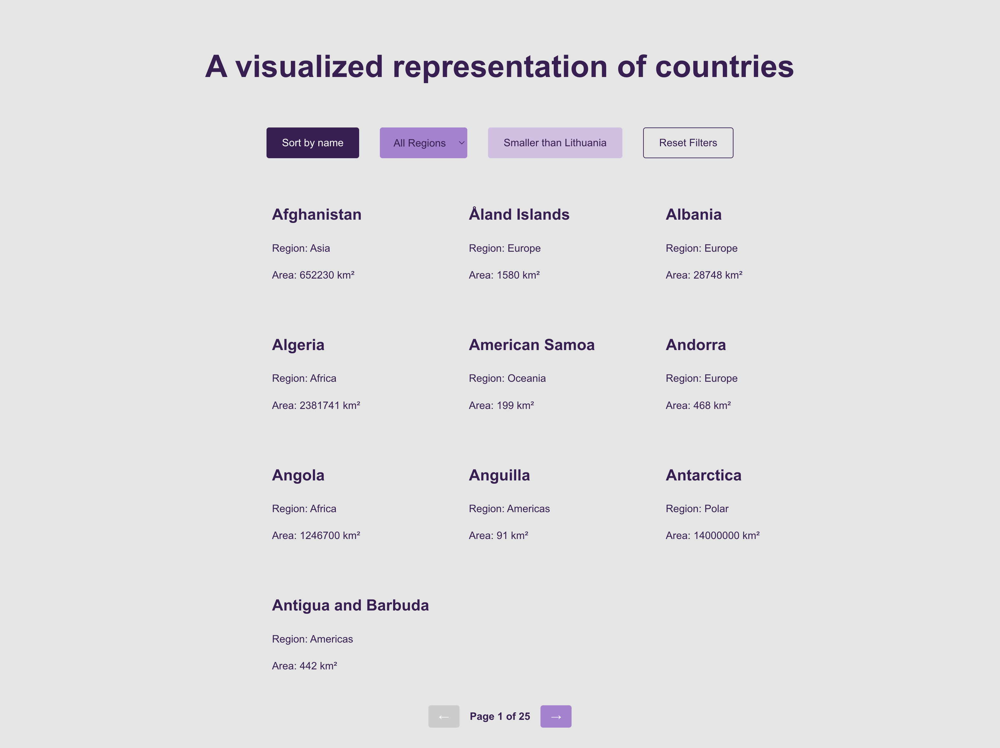
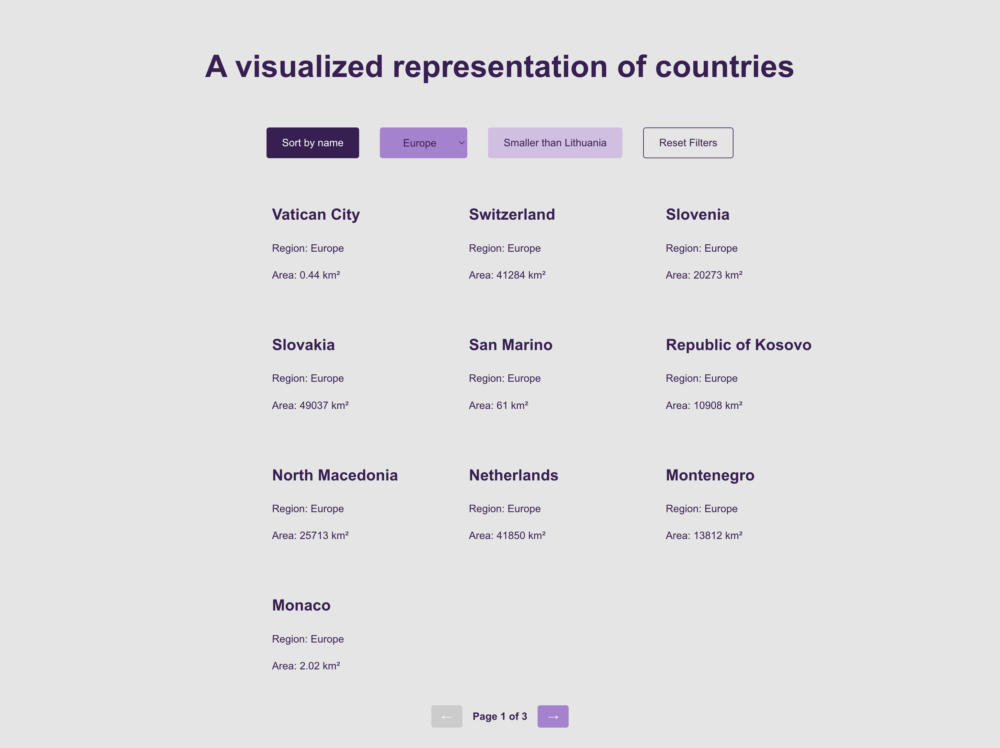

# Visualized Countries

Originally, the project used an API to filter countries by name, size (smaller than Lithuania), and region (Oceania). Over time, I improved it by adding pagination, expanding the regions, and adding a reset filter. I also focused on accessibility to enhance the user experience.

## Table of Contents

- [Visualized Countries](#visualized-countries)
  - [Table of Contents](#table-of-contents)
  - [Overview](#overview)
    - [The Challenge](#the-challenge)
    - [Screenshots](#screenshots)
    - [Links](#links)
  - [My Process](#my-process)
    - [Built With](#built-with)
    - [What I Learned](#what-i-learned)
    - [Continued Development](#continued-development)
    - [Useful Resources](#useful-resources)
  - [Installation Instructions](#installation-instructions)
  - [Dependencies](#dependencies)
  - [Usage Instructions](#usage-instructions)
  - [Project Structure](#project-structure)
  - [Author](#author)

## Overview

### The Challenge

Building the Visualized Countries app involved a few key challenges:

- **Efficient Filtering & Pagination**: Allowing users to filter countries by name, region, and size while keeping the app fast and responsive.
- **Easy Navigation & Reset**: Making it simple for users to browse results and reset filters when needed.

- **Accessibility & Usability**: Ensuring the app is easy to use for everyone, with a focus on accessibility.

### Screenshots

| Device      | State                                                       | Screenshot                                                                        |
| ----------- | ----------------------------------------------------------- | --------------------------------------------------------------------------------- |
| **Mobile**  | Default View                                                |         |
| **Desktop** | Default View                                                |       |
|             | With Filters Applied (Name, Europe, Smaller than Lithuania) |  |

### Links

- **[Live Demo](https://visualized-countries-app.vercel.app/)**: a live demonstration of the application.
- **[GitHub Repository](https://github.com/Doileo/visualized-countries-app)**: access the source code and project files.

## My Process

### Built With

- React.js
- Fetch API
- Vercel for Deployment
- Accessibility-focused design

### What I Learned

- How to implement efficient filtering and pagination
- Enhancing accessibility and usability for all users
- Optimizing API calls for better performance

### Continued Development

- Improving search efficiency
- Adding dark mode for better user experience
- Implementing a more detailed country view with additional data

### Useful Resources

- [MDN Web Docs](https://developer.mozilla.org/)
- [React Documentation](https://reactjs.org/docs/)

## Installation Instructions

1. Clone the repository:
   ```sh
   git clone https://github.com/Doileo/visualized-countries-app.git
   ```
2. Navigate to the project directory:
   ```sh
   cd visualized-countries-app
   ```
3. Install dependencies:
   ```sh
   npm install
   ```
4. Start the development server:
   ```sh
   npm start
   ```

## Dependencies

- React.js
- React Router

## Usage Instructions

1. Open the application in the browser.
2. Use the filters to search for countries based on name, region, or size.
3. Reset filters to view all countries again.
4. Click on pagination controls to browse more results.

## Project Structure

```
visualized-countries-app/
├── public/
│   ├── assets/
│   │   ├── screenshots/
├── src/
│   ├── components/
│   ├── App.css
│   ├── App.js
│   ├── index.js
├── package.json
```

## Author

- GitHub: [@Doileo](https://github.com/Doileo)
- LinkedIn: [Doina's Profile](https://www.linkedin.com/in/doinaleovchindeveloper/)
- GitHub - [@Doileo](https://github.com/Doileo)
