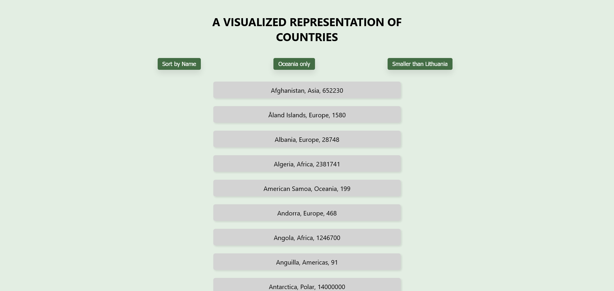

## A visualized countries app

This project aims to display information about different countries from around the world, including their names, regions, and area sizes. The information is fetched from the free API available at https://restcountries.com. The display of the information is implemented using React. The application features a clean and simple design with a green color scheme.
## Table of contents

- [Overview](#overview)
  - [The challenge](#the-challenge)
  - [Screenshot](#screenshot)
- [My process](#my-process)
  - [Built with](#built-with)
  - [My approach](#my-approach)
  - [Future Exploration](#future-exploration)
  - [Useful resources](#useful-resources)
- [Author](#author)

## Overview

### The challenge
1. Getting Started
To run this project locally, you will need to follow these steps:
- Clone or download the repository to your local machine.
- Navigate to the project folder in your terminal.
- Run npm install to install all necessary dependencies.
- Run npm start to start the development server.
- Visit http://localhost:3000 in your browser to see the project running locally.

2. Project Structure
The project consists of the following files and directories:
- src/App.js: This file contains the React code for the project.
- src/index.js: This file is the entry point of the project.
- src/App.css: This file contains the CSS styles for the project.

3. Features
    - Fetch data from the API.
    - Display a list of countries with their name, region, and area size.
    - Sort the list alphabetically by name (ascending and descending).
    - Filter countries by region (Oceania only) and by area (smaller than Lithuania).
### Screenshot

## My process

### Built with

- CSS
- Flexbox
- Mobile-first workflow
- [React](https://reactjs.org/) - JS library

### My approach

Here is a plan of actions I took to solve this challenge:

1. I went through the React documentation.
2. Decided on the design and layout of the application, keeping in mind the requirements of the project.
3. I decided to break down the problem into smaller components, and write code for each component.
4. Wrote the code for the main App component, which should import and render the other components.
5. Used CSS styles to style the components, making sure to use media queries to create a responsive design.
6. Test the application on different screen sizes and devices to ensure the layout is consistent and behaves as expected.
7. Added any additional improvements, and continued to debug until the application is fully functional.

### Future Exploration

- Adding Pagination: The current implementation displays all the items in a single page. One aspect I want
 to explore further is to add pagination to the project. This would allow the user to view a certain number of 
 items at a time and navigate to different pages to view the rest. I plan to research and implement different 
 pagination techniques that are best suited for this project.

### Useful resources 

These are the resources that I used to create the application and helped me complete this project.

- The official React documentation (https://reactjs.org/docs/getting-started.html)
- The CSS Flexbox Layout (https://css-tricks.com/snippets/css/a-guide-to-flexbox/)
- Media Queries (https://developer.mozilla.org/en-US/docs/Web/CSS/Media_Queries/Using_media_queries)
- React Components (https://reactjs.org/docs/components-and-props.html)
## Author

- Website - [Doina](https://doileo.github.io/portfolio/)
- LinkedIn - [Doina Leovchin](https://www.linkedin.com/in/doinaleovchindeveloper/)